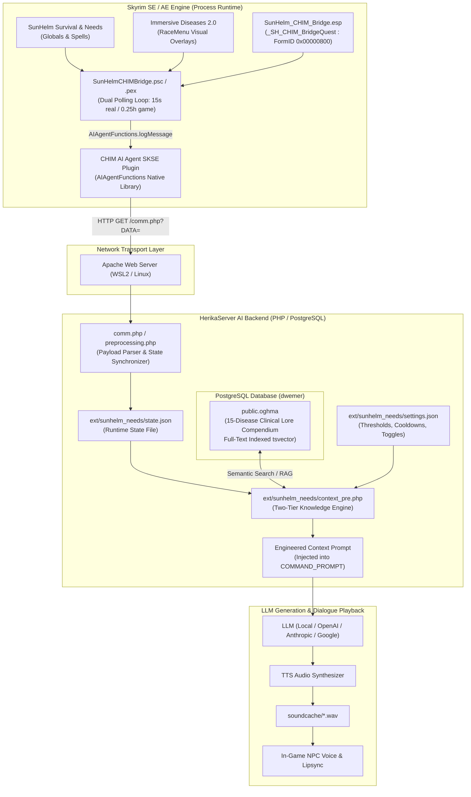
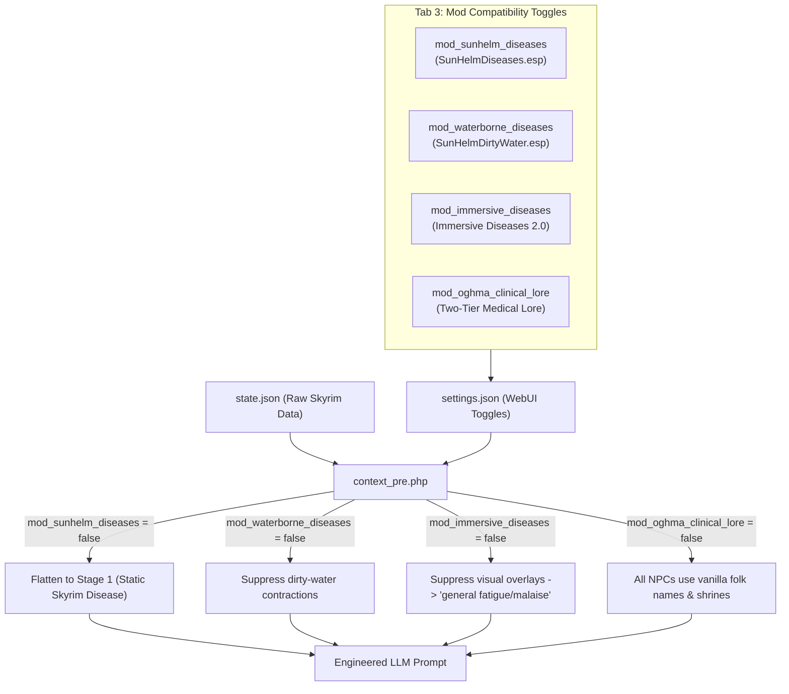

# Architectural & Technical Specification
## CHIM - Needs and Diseases Bridge (SunHelm & Immersive Diseases 2.0)

> **For Modders, Systems Engineers, and Autonomous LLM Agents:**  
> This document specifies the complete end-to-end architecture, communication protocol, Bethesda Papyrus runtime mechanics, database schemas, and AI prompt-injection pipelines powering this bridge. Use this guide to maintain, debug, or extend the project.

---

## 1. High-Level System Architecture



---

## 2. In-Engine Papyrus Runtime (`SunHelmCHIMBridge.psc`)

### A. Dual Polling Loops & Bethesda Event Dispatch Quirks
A common failure mode in Papyrus script bridges is relying solely on `RegisterForSingleUpdateGameTime()` or mixing it up with `Event OnUpdate()`.

#### The Engine Rule:
- `RegisterForSingleUpdate(float realSeconds)` $\rightarrow$ dispatches **only** to `Event OnUpdate()`.
- `RegisterForSingleUpdateGameTime(float gameHours)` $\rightarrow$ dispatches **only** to `Event OnUpdateGameTime()`.

If a script registers for game-time updates but only implements `Event OnUpdate()`, the engine drops the event silently.

#### The Dual-Loop Solution:
```papyrus
Event OnInit()
    Debug.Notification("[SunHelm Bridge] Initialized")
    CheckSunHelmNeeds()
    CheckDiseases()
    RegisterForSingleUpdate(5.0)
    RegisterForSingleUpdateGameTime(0.1)
EndEvent

Event OnUpdate()
    CheckSunHelmNeeds()
    CheckDiseases()
    RegisterForSingleUpdate(15.0)
EndEvent

Event OnUpdateGameTime()
    CheckSunHelmNeeds()
    CheckDiseases()
    RegisterForSingleUpdateGameTime(0.25)
EndEvent
```
- **Real-Time Loop (15 seconds):** Guarantees instant responsiveness during active exploration, combat, or social interactions. When the player contracts a disease or drinks from a stream, the status reaches the LLM within seconds.
- **Game-Time Loop (0.25 game hours):** Handles sleep, waiting, and fast-travel jumps where real-time seconds do not advance proportionally.
- **Fast Init:** The 5-second initial delay guarantees all masters, globals, and player forms are loaded before the first evaluation tick.

### B. Lazy Initialization & Fault-Tolerant Form Binding
The script does not hard-link SunHelm forms in the quest header. Instead, it uses `InitDiseases()` and `Game.GetFormFromFile()`:
```papyrus
Function InitDiseases()
    if (_diseasesInitialized)
        return
    endif

    if (Game.GetFormFromFile(0x00084C, "SunHelmDiseases.esp"))
        _shRockjoint3 = Game.GetFormFromFile(0x000857, "SunHelmDiseases.esp") as Spell
        _shRockjoint2 = Game.GetFormFromFile(0x000856, "SunHelmDiseases.esp") as Spell
        _shRockjoint1 = Game.GetFormFromFile(0x0B8782, "Skyrim.esm") as Spell
        ; ... 15 progression diseases ...
    else
        ; Graceful fallback to vanilla Skyrim.esm diseases
        _shRockjoint1 = Game.GetFormFromFile(0x0B8782, "Skyrim.esm") as Spell
        ; ...
    endif
    _diseasesInitialized = true
EndFunction
```
This guarantees zero Papyrus VM stack crashes even if optional ESPs are rearranged or missing from the user's load order.

### C. Water-Borne Diseases Integration (`SunHelmDirtyWater.esp`)
In SunHelm's survival ecosystem, drinking untreated water from lakes, rivers, or streams does not use Skyrim's base disease forms; instead, `SunHelmDirtyWater.esp` applies dedicated waterborne contagion spells directly to the player:

| Disease Spell | FormID | Target Illness | Visual Cue Mirroring |
|---|---|---|---|
| `WaterDiseaseChills` | `0x000812` | Chills (Stage 1) | `chills_shiver` |
| `WaterDiseaseDampworm` | `0x000813` | Dampworm (Stage 1) | `boils` |
| `WaterDiseaseDroops` | `0x000814` | Droops (Stage 1) | `limp_arm` |
| `WaterDiseaseFeebleLimb` | `0x000815` | Feeble Limb (Stage 1) | `necrotic_skin` |
| `WaterDiseaseShakes` | `0x000816` | Shakes (Stage 1) | `tremors` |
| `WaterDiseaseSwampFever` | `0x000817` | Swamp Fever (Stage 1) | `boils` |
| `WaterDiseaseWither` | `0x000818` | Wither (Stage 1) | `blotches` |

#### Detection Implementation:
In `InitDiseases()`, the script attempts to resolve `0x000812` from `SunHelmDirtyWater.esp`. If found, all 7 waterborne spells are bound into memory:
```papyrus
if (Game.GetFormFromFile(0x000812, "SunHelmDirtyWater.esp"))
    _shWaterChills     = Game.GetFormFromFile(0x000812, "SunHelmDirtyWater.esp") as Spell
    _shWaterDampworm   = Game.GetFormFromFile(0x000813, "SunHelmDirtyWater.esp") as Spell
    _shWaterDroops     = Game.GetFormFromFile(0x000814, "SunHelmDirtyWater.esp") as Spell
    _shWaterFeebleLimb = Game.GetFormFromFile(0x000815, "SunHelmDirtyWater.esp") as Spell
    _shWaterShakes     = Game.GetFormFromFile(0x000816, "SunHelmDirtyWater.esp") as Spell
    _shWaterSwampFever = Game.GetFormFromFile(0x000817, "SunHelmDirtyWater.esp") as Spell
    _shWaterWither     = Game.GetFormFromFile(0x000818, "SunHelmDirtyWater.esp") as Spell
endif
```
In `CheckDiseases()`, the Stage 1 checks evaluate both standard and waterborne forms:
```papyrus
elseif ((_shDampworm1 && player.HasSpell(_shDampworm1)) || (_shWaterDampworm && player.HasSpell(_shWaterDampworm)))
    dName  = "Dampworm"
    dStage = 1
    dCues  = "boils"
```
If the user does not use `SunHelmDirtyWater.esp`, the form pointers remain `None`, creating zero log spam, zero errors, and zero runtime overhead.

### D. Ambient Proximity Barks (Path B)
When the player has a noticeable illness (Stage $\ge 2$), the script uses CHIM's spatial agent queries:
```papyrus
if (dStage >= 2)
    float now = Utility.GetCurrentRealTime()
    if ((now - _lastAmbientBarkTime) >= 180.0)
        Actor nearbyAgent = AIAgentFunctions.getClosestAgent()
        if (nearbyAgent && nearbyAgent != player && !nearbyAgent.IsDead() && !nearbyAgent.IsInCombat())
            String npcName = nearbyAgent.GetActorBase().GetName()
            String barkPrompt = "You notice the player walking near you looking severely afflicted with " + dName + " (" + dCues + "). React aloud in one short sentence reflecting your personality."
            AIAgentFunctions.requestMessageForEligibleActor(barkPrompt, "chat", npcName)
            _lastAmbientBarkTime = now
        endif
    endif
endif
```
- Cooldown is tracked using `Utility.GetCurrentRealTime()` (monotonic real seconds) to prevent spam in crowded towns.
- `AIAgentFunctions.getClosestAgent()` ensures only AI-enabled actors receive the bark request.

---

## 3. Plugin Architecture (`SunHelm_CHIM_Bridge.esp`)

The plugin is a lightweight, Bethesda-compliant ESP designed for zero save footprint.

### Record Breakdown:
| Record | Subrecord | Size | Value / Meaning |
|---|---|---|---|
| **TES4** | `HEDR` | 12 bytes | Version: 1.7, NumRecords: 2, NextObjID: 0x0801 |
| | `MAST` | Variable | Masters: `Skyrim.esm`, `Update.esm`, `SunHelmSurvival.esp`, `AIAgent.esp` |
| **QUST** | FormID | 4 bytes | `0x00000800` (Local FormID) |
| | `EDID` | 21 bytes | `_SH_CHIM_BridgeQuest\0` |
| | `VMAD` | 28 bytes | Version 5, Format 2, Script count 1: `SunHelmCHIMBridge` (0 properties) |
| | `DNAM` | 12 bytes | `0100 0000 0000 0000 0000 0000` $\rightarrow$ **Bit 0: `Start Game Enabled`** |
| | `NEXT` | 0 bytes | Next Alias ID: 0 |
| | `ANAM` | 4 bytes | `00000000` |

### Serialization with Spriggit:
The plugin is maintained as a YAML specification:
```yaml
FormKey: 000800:SunHelm_CHIM_Bridge.esp
EditorID: _SH_CHIM_BridgeQuest
VirtualMachineAdapter:
  Scripts:
  - Name: SunHelmCHIMBridge
  Versioning:
  - Break0
  ExtraBindDataVersion: 0
  FileName: ''
Flags:
- StartGameEnabled
QuestFormVersion: 0
NextAliasID: 0
```
To compile or decompile:
```bash
# Decompile ESP to YAML
spriggit serialize -i SunHelm_CHIM_Bridge.esp -o bridge_yaml -g SkyrimSE -p Spriggit.Yaml.Skyrim -v 0.41

# Compile YAML to binary ESP
spriggit deserialize -i bridge_yaml -o SunHelm_CHIM_Bridge.esp -p Spriggit.Yaml.Skyrim -v 0.41
```

---

## 4. Communication Protocol & Payload Specs

All data between Skyrim and HerikaServer is transferred via Base64-encoded strings over HTTP GET:

```
http://<server-ip>:8081/HerikaServer/comm.php?DATA=<base64_string>
```

### A. Needs Payload
```
sunhelm_needs@<hunger_stage>@<thirst_stage>@<fatigue_stage>@<cold_stage>
```
- **Example:** `sunhelm_needs@2@2@1@2`
- **Fields:**
  - `hunger_stage` (0–5): 0=Well Fed, 1=Satisfied, 2=Peckish, 3=Hungry, 4=Ravenous, 5=Starving.
  - `thirst_stage` (0–5): 0=Quenched, 1=Sated, 2=Thirsty, 3=Parched, 4=Dehydrated, 5=Severely Dehydrated.
  - `fatigue_stage` (0–5): 0=Well Rested, 1=Rested, 2=Slightly Tired, 3=Tired, 4=Weary, 5=Exhausted.
  - `cold_stage` (0–5): 0=Warm, 1=Comfortable, 2=Chilly, 3=Cold, 4=Freezing, 5=Frigid.

### B. Disease Payload
```
sunhelm_disease@<disease_name>@<stage_int>@<visual_cues>
```
- **Example:** `sunhelm_disease@Rockjoint@2@locked_joints,purple_veins`
- **Cure Payload:** `sunhelm_disease@None@0@None`
- **Visual Cues Dictionary:**
  - `locked_joints` $\rightarrow$ Crooked locked elbows, rigid posture.
  - `limp_arm` $\rightarrow$ Muscle flaccidity, motor impairment.
  - `purple_veins` $\rightarrow$ Dark bulging subcutaneous veins.
  - `boils` $\rightarrow$ Suppurating pustules and lesions.
  - `blotches` $\rightarrow$ Erythematous rashes, fever flushed skin.
  - `necrotic_skin` $\rightarrow$ Tissue necrosis, grayish decay.
  - `violent_cough` $\rightarrow$ Paroxysmal coughing, whooping spasms.
  - `stomach_cramps` $\rightarrow$ Abdominal clutching, nausea, gastrointestinal spasms.
  - `chills_shiver` $\rightarrow$ Rigors, hypothermic shivering.
  - `tremors` $\rightarrow$ Involuntary shaking, nerve spasms.

### C. Server State Schema (`state.json`)
The parsed payloads are written atomically into `/var/www/html/HerikaServer/ext/sunhelm_needs/state.json`:
```json
{
    "player": {
        "hunger": 2,
        "thirst": 2,
        "fatigue": 1,
        "cold": 2
    },
    "followers": [],
    "updated_at": "2026-09-21 12:25:37",
    "player_needs": {
        "hunger_stage": 2,
        "hunger_label": "Peckish",
        "thirst_stage": 2,
        "thirst_label": "Thirsty",
        "fatigue_stage": 1,
        "fatigue_label": "Rested",
        "cold_stage": 2,
        "cold_label": "Chilly"
    },
    "player_disease": {
        "has_disease": true,
        "disease_name": "Rockjoint",
        "stage": 2,
        "stage_label": "Acute Rockjoint",
        "visual_cues": "locked_joints,purple_veins",
        "updated_at": "2026-09-21 12:25:37"
    }
}
```

---

## 5. Two-Tier Knowledge Engine (`context_pre.php`)

When an NPC generates speech, `context_pre.php` inspects `state.json` and dynamically engineers the context prompt based on the NPC's role.

### A. Role Classifier
NPCs are classified using case-insensitive keyword and name matching:
```php
$isExpert = false;
$expertKeywords = [
    'apothecary', 'alchemist', 'healer', 'scholar', 'priest', 
    'priestess', 'doctor', 'physician', 'mage', 'wizard', 'sorcerer'
];
$knownExperts = [
    'arcadia', 'danica', 'danica pure-spring', 'colette', 'colette mence',
    'farengar', 'farengar secret-fire', 'nurelion', 'quintus navale',
    'zaria', 'elgrim', 'ingun black-briar', 'babette', 'falion',
    'runil', 'jora', 'dinya balu', 'maramal', 'sygna', 'andurs'
];
```

### B. Prompt Injection Divergence

#### 1. Commoner / Guard / Mercenary Prompt (Folklore Tier):
```
Health Observation: You visibly notice the player exhibiting unnatural crooked locked elbows and rigid joint posture; prominent dark purple veins bulging beneath the skin. You recognize this as the common affliction known as Rockjoint. Sufferers are in visible pain, and folk wisdom advises visiting an apothecary or praying at a divine shrine. [Behavior Directive: ACUTE CONCERN: The player's symptoms are conspicuous and impairing. Express concern or caution about contagion naturally in your reply.]
```

#### 2. Expert / Apothecary / Scholar Prompt (Clinical Lore Tier):
```
Health Observation: You visibly notice the player exhibiting unnatural crooked locked elbows and rigid joint posture; prominent dark purple veins bulging beneath the skin. As a trained apothecary, healer, or scholar, you diagnose this as Tetanus (known to commoners as Rockjoint), caused by acute synovial calcification and tendon contracture from predator saliva. You know it requires Mudcrab Chitin and Hawk Feathers to cure. [Behavior Directive: ACUTE CONCERN: The player's symptoms are conspicuous and impairing. Express concern or caution about contagion naturally in your reply.]
```

### C. Severity Scaling Directives
| Stage | Severity | Directive Injected |
|---|---|---|
| **1** | Mild | `MILD/SUBTLE: The player shows early, faint signs. Do not obsess over it; acknowledge it gently or in passing only if relevant.` |
| **2** | Acute | `ACUTE CONCERN: The player's symptoms are conspicuous and impairing. Express concern or caution about contagion naturally in your reply.` |
| **3** | Severe | `CRITICAL EMERGENCY: The player appears dangerously ill and incapacitated. Urge immediate medical treatment, divine intervention, or bedrest.` |

---

## 6. Modular Mod Compatibility & WebUI Toggle System

To ensure complete independence from non-core mods, the bridge employs a **Zero-Dependency Architecture**. While `SunHelmSurvival.esp` is the only required master, four auxiliary systems can be toggled on or off at runtime via the WebUI (`config.php` &rarr; **Tab 3: Mod Compatibility**):



### Toggle Mechanics & Fallbacks:
1. **SunHelm Diseases (`mod_sunhelm_diseases`):**
   - *Enabled:* Evaluates full 3-stage progression (Stage 1 Mild &rarr; Stage 2 Acute &rarr; Stage 3 Severe) with emergency directives.
   - *Bypassed:* Flattens `$stage = 1` and `$stageLabel = $dName` (e.g. "Rockjoint" instead of "Acute Rockjoint"). NPCs react with gentle concern rather than emergency panic.
2. **Water-Borne Diseases (`mod_waterborne_diseases`):**
   - *Enabled:* Catches illnesses contracted from drinking raw lake/river water (`_shWater*` spells with `waterborne` cue).
   - *Bypassed:* Silently drops dirty water contraction events from reaching NPC prompts.
3. **Immersive Diseases 2.0 (`mod_immersive_diseases`):**
   - *Enabled:* Translates raw cue flags into detailed RaceMenu visual descriptions (bulging purple veins, locked elbows, limp arm, boils, blotches).
   - *Bypassed:* Replaces overlay text with `"visible signs of illness and physical fatigue"`. This guarantees NPCs will never hallucinate visual textures or posture meshes that are not actually installed in the player's game.
4. **Two-Tier Oghma Clinical Lore (`mod_oghma_clinical_lore`):**
   - *Enabled:* Expert alchemists, healers, scholars, and mages diagnose true clinical pathology (Tetanus, Breakbone Fever, Meningitis, Dracunculiasis) and prescribe specific ingredients.
   - *Bypassed:* All NPCs (including master apothecaries) use traditional Skyrim folklore names and divine shrine advice.

---

## 7. Oghma Medical Lore Compendium (`oghma_diseases.sql`)

### Database Table: `public.oghma`
All 15 diseases are stored as knowledge entries with PostgreSQL full-text search vectors:
- **`topic`:** Unique slug (e.g. `rockjoint`, `swamp_fever`, `witbane`).
- **`content`:** Two-tier entry containing commoner folklore and clinical pathology adapted to Tamriel.
- **`tsv`:** `tsvector` weighted column (`setweight(to_tsvector('english', topic), 'A') || setweight(to_tsvector('english', content), 'B')`).

### Disease Mapping Matrix:
| Vanilla / Folklore Name | Clinical Lore Name | Vector / Etiology | Alchemical Counter-Agents | Visual Overlays |
|---|---|---|---|---|
| **Rockjoint** | Tetanus | Sabre cat scratches, wolf bites, bear saliva | Mudcrab Chitin, Hawk Feathers | `locked_joints,purple_veins` |
| **Bone Break Fever** | Breakbone Fever | Cave bears, contaminated rat bites | Charred Skeever Hide, Feather | `blotches,chills_shiver` |
| **Brain Rot** | Meningitis | Hagraven curses, Falmer scratch, infected carrion | Deathbell, Salt Pile | `headache,necrotic_skin` |
| **Ataxia** | Peripheral Neuropathy | Skeever scratches, tainted traps | Blisterwort, Mudcrab Chitin | `limp_arm` |
| **Rattles** | Pertussis (Whooping Cough) | Chaurus fumes, spore inhalation | Swamp Fungal Pod, Hawk Feathers | `violent_cough,tremors` |
| **Witbane** | Ergotism | Blighted wheat, sabre cat saliva | Hawk Feathers, Vampire Dust | `headache,tremors` |
| **Dampworm** | Dracunculiasis | Parasitic Falmer cave water, stagnant pools | Slaughterfish Egg, Lavender | `purple_veins` |
| **Swamp Fever** | The Ague (Malaria analogue) | Hjaalmarch miasmas, mudcrab bites | Swamp Fungal Pod, Garlic | `chills_shiver,blotches` |
| **The Chills** | Hypothermic Rigors | Freezing glacier runoff, pale water immersion | Fire Salts, Elves Ear | `chills_shiver` |
| **Feeble Limb** | Necrotizing Fasciitis | Draugr burial wounds, tomb filth | Bone Meal, Garlic | `limp_arm,necrotic_skin` |
| **The Shakes** | Rat-Bite Fever | Skeever and vermin bites | Tundra Cotton, Lavender | `tremors` |
| **The Wither** | Cutaneous Atrophy | Tainted soil, spriggan spore contact | Blue Mountain Flower, Wheat | `blotches,necrotic_skin` |
| **The Droops** | Ash-Palsy (Myasthenia) | Red Mountain ash storms, ash hopper secretions | Ashen Grass Pod, Scathecraw | `limp_arm` |
| **Astral Vapors** | Miasmatic Sickness | Dread Zombie exposure, planar rifts | Void Salts, Lavender | `purple_veins,chills_shiver` |
| **Food Poisoning** | Trichinosis | Raw meat, rancid mammoth cheese, spoiled rations | Charred Skeever Hide, Garlic | `stomach_cramps` |

---

## 8. How to Extend This Project

### Adding a New Disease (e.g. from Beyond Skyrim or a Custom Mod)

1. **Add Spells in `SunHelmCHIMBridge.psc`:**
   ```papyrus
   Spell _shNewDisease3 = None
   Spell _shNewDisease2 = None
   Spell _shNewDisease1 = None
   ```
2. **Bind FormIDs in `InitDiseases()`:**
   ```papyrus
   _shNewDisease3 = Game.GetFormFromFile(0x001234, "NewMod.esp") as Spell
   ```
3. **Add Detection Branch in `CheckDiseases()`:**
   ```papyrus
   elseif (_shNewDisease2 && player.HasSpell(_shNewDisease2))
       dName = "New Disease"
       dStage = 2
       dCues = "blotches,tremors"
   ```
4. **Compile Papyrus:**
   ```bash
   bash compile.sh
   ```
5. **Add Lore to `oghma_diseases.sql`:**
   Add an `INSERT INTO public.oghma` row with the commoner folklore and clinical pathology.
6. **Deploy:**
   ```bash
   bash install.sh
   ```
